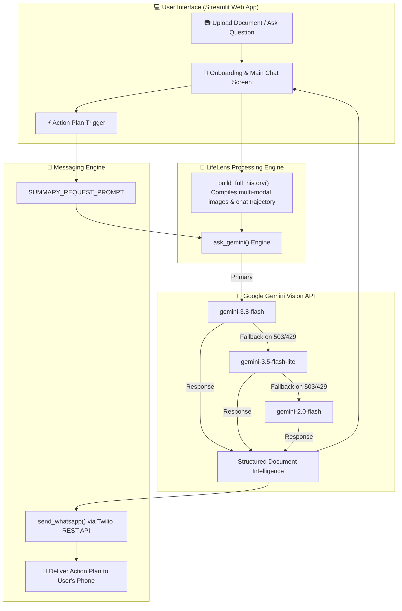
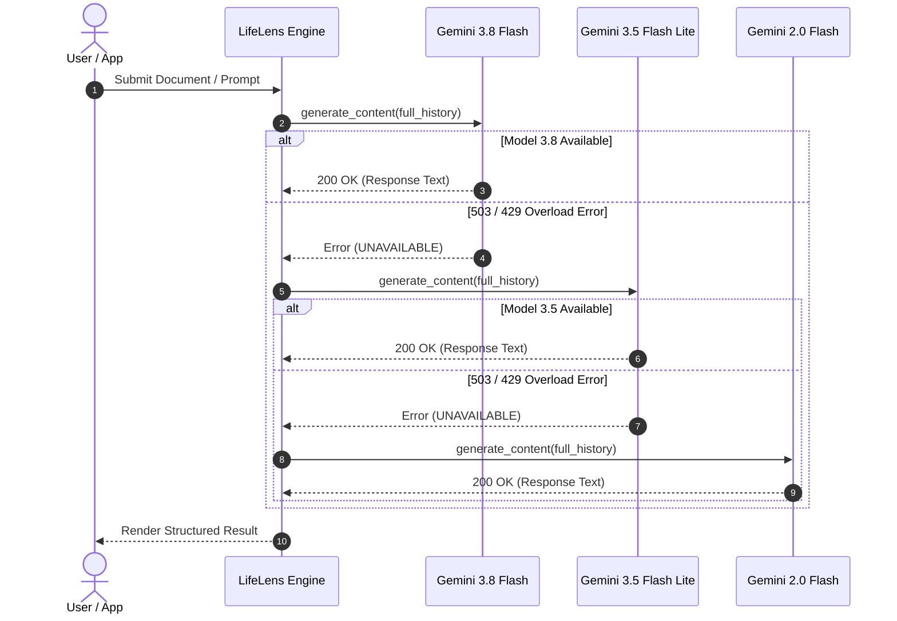

# 🧠 LifeLens AI — Document-to-Action Assistant

> **"Don't just understand your documents — know what to do next."**

[](https://streamlit.io)
[](https://aistudio.google.com)
[](https://twilio.com)
[](https://python.org)

**LifeLens AI** is an intelligent visual assistant that transforms physical and digital documents — timetables, circulars, utility bills, flight tickets, lab reports — into structured, prioritized, actionable intelligence. It extracts key facts, highlights deadlines, flags ambiguities, and dispatches a clean Action Plan straight to your WhatsApp phone.

---

## 📌 Table of Contents

- [💡 Problem Statement \& Solution](#-problem-statement--solution)
- [🏗️ System Architecture](#️-system-architecture)
- [🛡️ Multi-Model Fallback Waterfall](#️-multi-model-fallback-waterfall)
- [🗂️ Supported Document Categories](#️-supported-document-categories)
- [✨ Core Capabilities](#-core-capabilities)
- [📁 Project Directory Structure](#-project-directory-structure)
- [💻 Local Installation \& Quickstart](#-local-installation--quickstart)
- [🌐 Streamlit Community Cloud Deployment](#-streamlit-community-cloud-deployment)
- [📱 Twilio WhatsApp Sandbox Setup](#-twilio-whatsapp-sandbox-setup)
- [🔒 Security \& Secrets Management](#-security--secrets-management)
- [🏆 Evaluation Criteria Coverage](#-evaluation-criteria-coverage)

---

## 💡 Problem Statement & Solution

### The Problem
Every day, students, workers, and households receive critical physical and digital documents: college time tables, fee circulars, medical lab reports, flight tickets, and utility bills. Users often miss important deadlines or fail to identify required action items due to information overload and dense document formatting.

### The LifeLens AI Solution
LifeLens AI bridges the gap between static document understanding and real-world task execution:
1. **Visual Parsing**: Upload any photo or scan (`JPG`, `PNG`).
2. **Structured Analysis**: Classifies category, assesses priority (`HIGH`, `MEDIUM`, `LOW`), extracts dates, key terms, and missing warnings.
3. **Multi-Turn Contextual Q&A**: Ask follow-up questions (*"Who is the faculty for POM?"*) while maintaining complete multi-modal document context.
4. **WhatsApp Push**: Generates a mobile-formatted action checklist and sends it directly to your phone.

---

## 🏗️ System Architecture



---

## 🛡️ Multi-Model Fallback Waterfall

To prevent downtime from model overloads or transient 503/429 errors, LifeLens AI implements a silent multi-model fallback waterfall:



---

## 🗂️ Supported Document Categories

| Category | Icon | Typical Document Types | Key Extractions |
| :--- | :---: | :--- | :--- |
| **College** | 🏫 | Exam timetables, circulars, hall tickets, fee deadlines | Exam dates, subject codes, faculty names, room numbers, fee cutoffs |
| **Everyday** | 🏠 | Utility bills, receipts, service notices, warranty cards | Due dates, payable amount, vendor details, warranty coverage |
| **Work** | 💼 | HR notices, onboarding guides, policy updates, meeting notes | Effective dates, required forms, compliance deadlines |
| **Travel** | ✈️ | Train/flight tickets, hotel confirmations, itineraries | PNR, boarding time, departure/arrival terminals, gate info |
| **Medical** | 🏥 | Lab reports, prescriptions, appointment slips | Informational metrics, appointment times *(No medical diagnosis)* |

---

## ✨ Core Capabilities

- 👁️ **Multi-Modal Vision Understanding**: Processes unstructured photos, table layouts, signatures, and handwritten notes.
- ⚡ **Priority Matrix Assessment**: Categorizes priority into **🚨 HIGH**, **⚡ MEDIUM**, or **🟢 LOW** based on cutoff dates and consequences.
- 💬 **Persistent Multi-Turn Context**: Remembers previous image uploads across follow-up text questions.
- 📤 **One-Click WhatsApp Integration**: Delivers action items straight to your mobile device via Twilio REST API.
- 🎨 **Modern Responsive UI**: Built with a sleek dark theme, glassmorphism, and responsive layout.

---

## 📁 Project Directory Structure

```
LifelensAI/
├── app.py                          # Main Streamlit web application & interface logic
├── prompts.py                      # System prompts, welcome templates & summary formatters
├── requirements.txt                # Python dependencies (Streamlit, google-genai, twilio, Pillow, dotenv)
├── README.md                       # Comprehensive project documentation
├── .gitignore                      # Git exclusion rules for secrets, virtual environments, and cache
├── .env.example                    # Template for environment variables
└── .streamlit/
    ├── config.toml                 # Streamlit theme & layout configuration
    └── secrets.toml.example        # Safe template for Streamlit Cloud deployment
```

---

## 💻 Local Installation & Quickstart

### Prerequisites
- **Python 3.10+** installed
- **Google Gemini API Key** (from [AI Studio](https://aistudio.google.com))
- **Twilio Sandbox Account** (from [Twilio Console](https://console.twilio.com))

### 1. Clone the repository
```bash
git clone https://github.com/Siva-2511/Lifelens-AI.git
cd Lifelens-AI
```

### 2. Create and activate a virtual environment
```bash
# Windows
python -m venv venv
.\venv\Scripts\activate

# macOS / Linux
python3 -m venv venv
source venv/bin/activate
```

### 3. Install dependencies
```bash
pip install -r requirements.txt
```

### 4. Configure environment variables
Create a `.env` file in the root directory (or copy `.env.example`):

```ini
GEMINI_API_KEY=your_gemini_api_key_here
TWILIO_ACCOUNT_SID=your_twilio_account_sid_here
TWILIO_AUTH_TOKEN=your_twilio_auth_token_here
TWILIO_WHATSAPP_FROM=whatsapp:+14155238886
```

### 5. Launch the Streamlit application
```bash
streamlit run app.py
```
Open [http://localhost:8501](http://localhost:8501) in your browser.

---

## 🌐 Streamlit Community Cloud Deployment

1. Push your code to your GitHub repository (ensure `.env` and `.streamlit/secrets.toml` are in `.gitignore`).
2. Log in to [share.streamlit.io](https://share.streamlit.io).
3. Click **New app** and select repository `Siva-2511/Lifelens-AI`, branch `main`, main file `app.py`.
4. Under **Advanced settings... -> Secrets**, paste:

```toml
GEMINI_API_KEY = "your_gemini_api_key_here"
TWILIO_ACCOUNT_SID = "your_twilio_account_sid_here"
TWILIO_AUTH_TOKEN = "your_twilio_auth_token_here"
TWILIO_WHATSAPP_FROM = "whatsapp:+14155238886"
```

5. Click **Deploy!**

---

## 📱 Twilio WhatsApp Sandbox Setup

To receive Action Plans on your phone:
1. Open WhatsApp on your mobile phone.
2. Send a WhatsApp message with the code specified in your [Twilio Sandbox Console](https://console.twilio.com/us1/develop/sms/settings/whatsapp-sandbox) to **+1 415 523 8886**.
3. Enter your phone number with country code (e.g. `+919445824574`) during the LifeLens AI onboarding.

---

## 🔒 Security & Secrets Management

- **Zero Hardcoded Secrets**: All credentials are strictly fetched from environment variables (`os.environ`) or Streamlit secrets (`st.secrets`).
- **Git Safety**: `.env` and `.streamlit/secrets.toml` are excluded in `.gitignore`.
- **Diagnostic Safety**: Error handlers display safe message summaries without exposing full key strings or sensitive tokens.

---

## 🏆 Evaluation Criteria Coverage

| Criteria | Weight | Implementation Details in LifeLens AI |
|---|:---:|---|
| **Functionality** | **40%** | End-to-end document parsing, image extraction, multi-turn follow-up Q&A, and Twilio WhatsApp delivery working reliably. |
| **Prompt Design** | **20%** | System prompt in `prompts.py` strictly scopes document analysis (Classification, Priority, Key Facts, Deadlines, Required Actions, Warnings) with safety guidelines. |
| **Code Quality** | **20%** | Clean modular architecture (`app.py`, `prompts.py`), AST syntax verified, fallback resilience, zero committed secrets. |
| **Visual & UI Polish** | **20%** | Glassmorphic dark design, priority badge highlights, mobile-friendly action cards, and centered layout. |

---

<div align="center">
  <sub>Built with 🧠 Google Gemini Vision & Twilio WhatsApp</sub>
</div>
